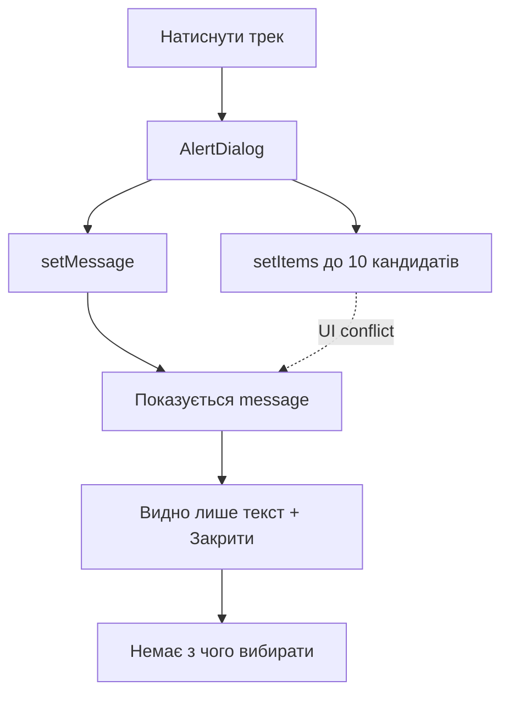
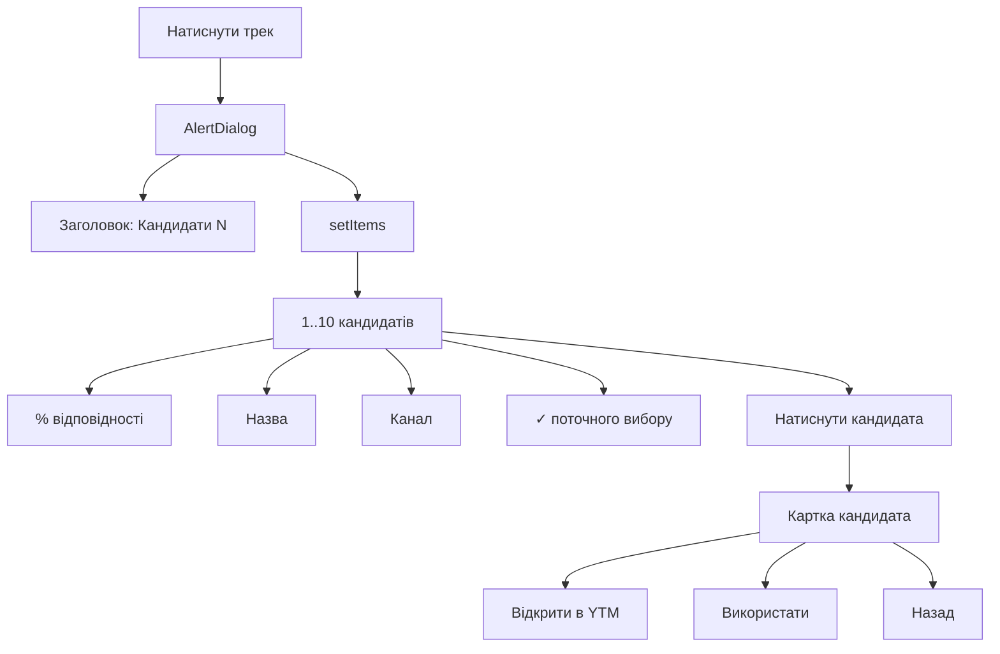

# Hotfix v0.7.1 — Було / Стало

## Було

У v0.6/v0.7 діалог одночасно використовував `setMessage()` і `setItems()`.
На телефоні показувалася підказка, а список кандидатів не відображався.

## Стало — v0.7.1

`setMessage()` прибрано з діалогу кандидатів.
Кількість кандидатів показується в заголовку, а список формує `setItems()`.

