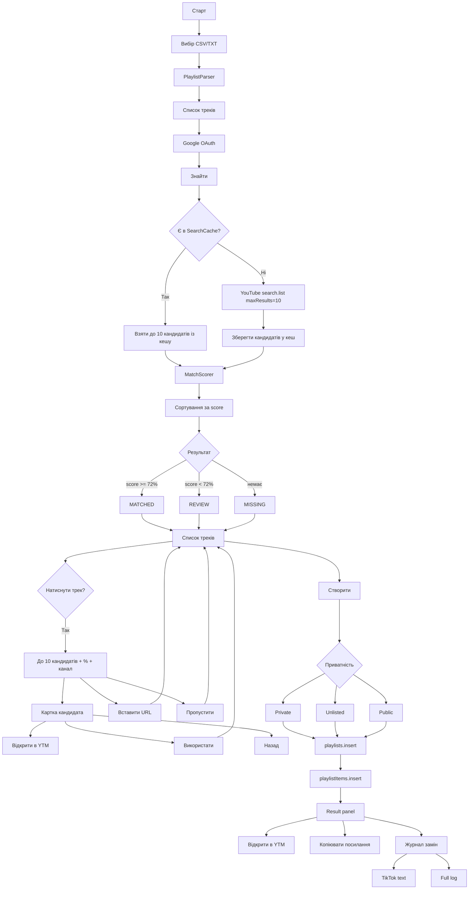

# YTM Importer v0.7.1 — Current Flow

```mermaid
flowchart TD
    A[Старт] --> B[Вибір CSV/TXT]
    B --> C[PlaylistParser]
    C --> D[Список треків]
    D --> E[Google OAuth]
    E --> F[Знайти]

    F --> G{Є в SearchCache?}
    G -- Так --> H[Взяти до 10 кандидатів із кешу]
    G -- Ні --> I[YouTube search.list maxResults=10]
    I --> J[Зберегти кандидатів у кеш]

    H --> K[MatchScorer]
    J --> K
    K --> L[Сортування за score]

    L --> M{Результат}
    M -->|score >= 72%| N[MATCHED]
    M -->|score < 72%| O[REVIEW]
    M -->|немає| P[MISSING]

    N --> Q[Список треків]
    O --> Q
    P --> Q

    Q --> R{Натиснути трек?}
    R -- Так --> S[До 10 кандидатів + % + канал]
    S --> T[Картка кандидата]
    T --> U[Відкрити в YTM]
    T --> V[Використати]
    T --> W[Назад]
    S --> X[Вставити URL]
    S --> Y[Пропустити]

    V --> Q
    X --> Q
    Y --> Q

    Q --> Z[Створити]
    Z --> AA{Приватність}
    AA --> AB[Private]
    AA --> AC[Unlisted]
    AA --> AD[Public]

    AB --> AE[playlists.insert]
    AC --> AE
    AD --> AE
    AE --> AF[playlistItems.insert]
    AF --> AG[Result panel]

    AG --> AH[Відкрити в YTM]
    AG --> AI[Копіювати посилання]
    AG --> AJ[Журнал замін]
    AJ --> AK[TikTok text]
    AJ --> AL[Full log]
```
