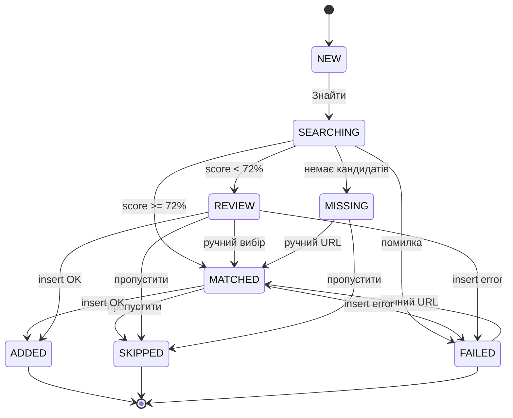

# YTM Importer v0.7.1 — Track State Flow

```mermaid
stateDiagram-v2
    [*] --> NEW
    NEW --> SEARCHING: Знайти

    SEARCHING --> MATCHED: score >= 72%
    SEARCHING --> REVIEW: score < 72%
    SEARCHING --> MISSING: немає кандидатів
    SEARCHING --> FAILED: помилка

    REVIEW --> MATCHED: ручний вибір
    MISSING --> MATCHED: ручний URL
    FAILED --> MATCHED: ручний URL

    MATCHED --> SKIPPED: пропустити
    REVIEW --> SKIPPED: пропустити
    MISSING --> SKIPPED: пропустити

    MATCHED --> ADDED: insert OK
    REVIEW --> ADDED: insert OK

    MATCHED --> FAILED: insert error
    REVIEW --> FAILED: insert error

    ADDED --> [*]
    SKIPPED --> [*]
    FAILED --> [*]
```
