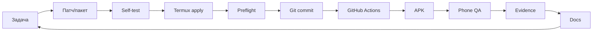

# 02 — Робочий цикл: телефон + Termux + GitHub + ChatGPT

Це один із найважливіших розділів курсу.

## Ролі

### ChatGPT

- готує завершені зміни;
- формує versioned overlay package;
- пише apply/self-test scripts;
- готує QA docs;
- дає точний Termux block.

### Розробник

- запускає команди;
- контролює Git;
- встановлює APK;
- тестує на реальному телефоні;
- надсилає фактичний evidence;
- приймає рішення про наступний крок.

## Базовий цикл

## Чому overlay package

Пакет не повинен «замінювати проєкт».

Він містить тільки підготовлені зміни.

Переваги:

- легше побачити scope;
- менше ризиків для історичних docs;
- можна прогнати apply кілька разів;
- простіше відновитися після STOP.

## Перед зміною репозиторію

Перевіряємо:

- правильна branch;
- clean working tree;
- package знайдений;
- self-test package;
- `apply --check`.

## Після apply

Перевіряємо:

- `git diff --check`;
- audits;
- release preflight;
- немає tracked deletions;
- немає випадкових untracked files;
- staged set містить тільки очікувані файли.

## Чому GitHub Actions

Телефон/Termux не мусить бути повноцінною Android build workstation.

GitHub Actions дає:

- стабільне Java/SDK середовище;
- signed release APK;
- repeatable build;
- artifact;
- checksum.

## Що не можна автоматизувати повністю

Реальний UX.

Саме тому фінальний крок — телефонний QA, а не зелений CI.
