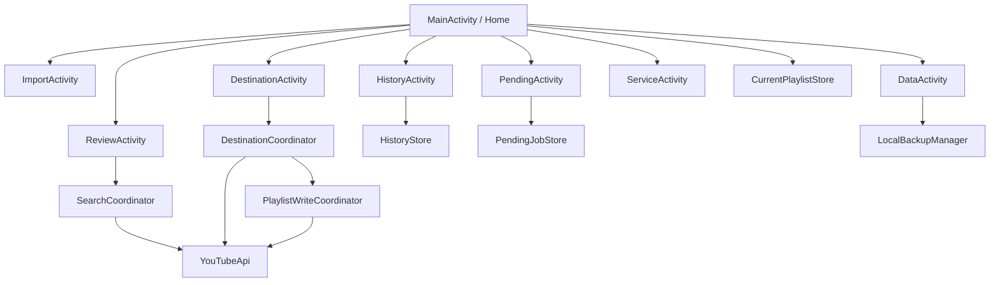

# 03 — Карта архітектури

Це спрощена карта поточного підходу, а не повний class reference.

## UI layer

Окремі Activity відображають конкретні етапи сценарію.

Це краще, ніж один величезний екран, тому що:

- простіше тестувати;
- простіше документувати;
- менше випадкових залежностей;
- навігація сама підказує межі відповідальності.

## Coordinator layer

Coordinator потрібен, коли Activity починає знати забагато про доменну операцію.

Наприклад:

- search orchestration;
- destination selection;
- duplicate planning;
- write planning.

Activity повинна переважно:

- отримати user action;
- викликати операцію;
- показати стан/результат.

## Storage layer

Локальне збереження існує не «про запас», а для конкретних recovery-сценаріїв:

- current workspace;
- history;
- pending queue;
- backup;
- cache.

## API layer

YouTube API має зовнішні обмеження:

- авторизація;
- quota;
- network errors;
- exact resource identifiers.

Тому API не повинен бути «невидимою деталлю». Його обмеження впливають на UX і архітектуру.
