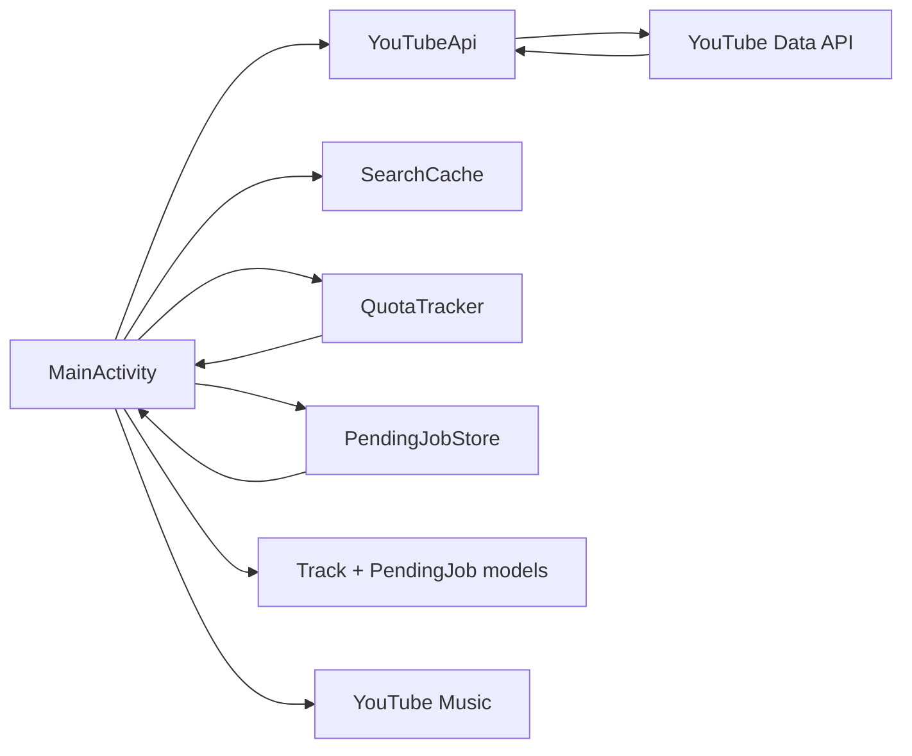

# YTM Importer v0.10.0 — Архітектура

```mermaid
flowchart LR
    UI[MainActivity]
    API[YouTubeApi]
    CACHE[SearchCache]
    QUOTA[QuotaTracker]
    PENDING[PendingJobStore]
    MODEL[Track + PendingJob models]
    YT[YouTube Data API]
    YTM[YouTube Music]

    UI --> CACHE
    UI --> QUOTA
    UI --> PENDING
    UI --> MODEL
    UI --> API

    API --> YT
    YT --> API

    QUOTA --> UI
    PENDING --> UI

    UI --> YTM
```

## Нові файли

- `storage/QuotaTracker.kt`
- `storage/PendingJobStore.kt`
- `model/PendingJob.kt`
- `scripts/download-latest-apk.sh`
