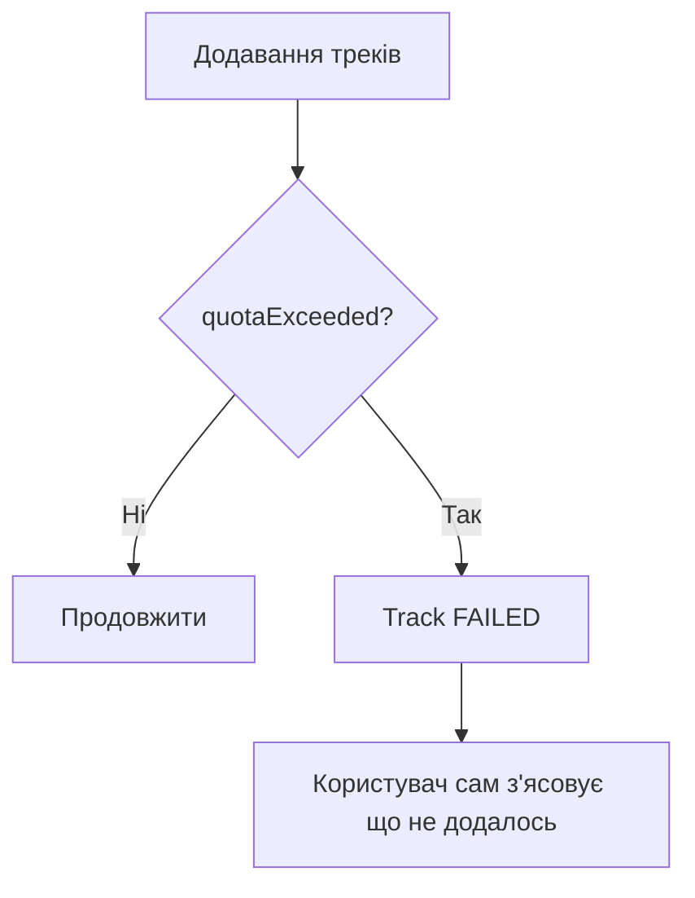
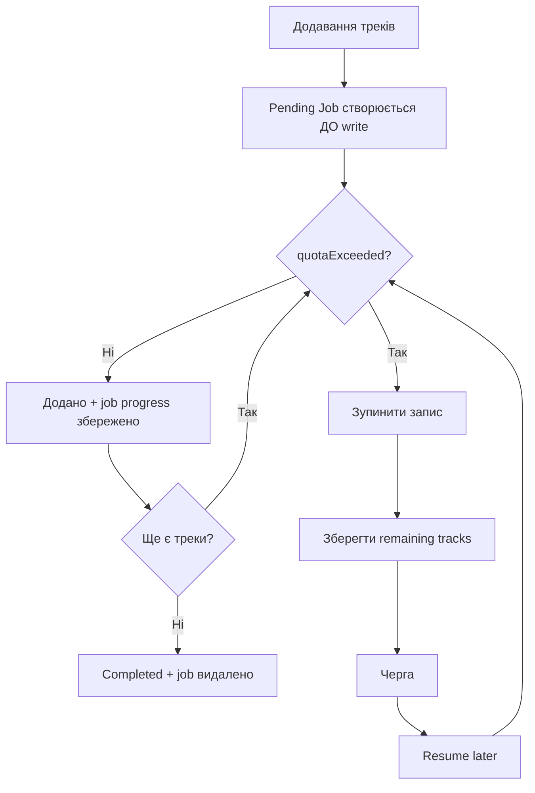

# v0.10.0 — Було / Стало

## Було — v0.9.1

```mermaid
flowchart TD
    A[Додавання треків]
    --> B{quotaExceeded?}
    B -- Ні --> C[Продовжити]
    B -- Так --> D[Track FAILED]
    D --> E[Користувач сам з'ясовує що не додалось]
```

## Стало — v0.10.0

```mermaid
flowchart TD
    A[Додавання треків]
    --> B[Pending Job створюється ДО write]
    --> C{quotaExceeded?}

    C -- Ні --> D[Додано + job progress збережено]
    D --> E{Ще є треки?}
    E -- Так --> C
    E -- Ні --> F[Completed + job видалено]

    C -- Так --> G[Зупинити запис]
    G --> H[Зберегти remaining tracks]
    H --> I[Черга]
    I --> J[Resume later]
    J --> C
```
