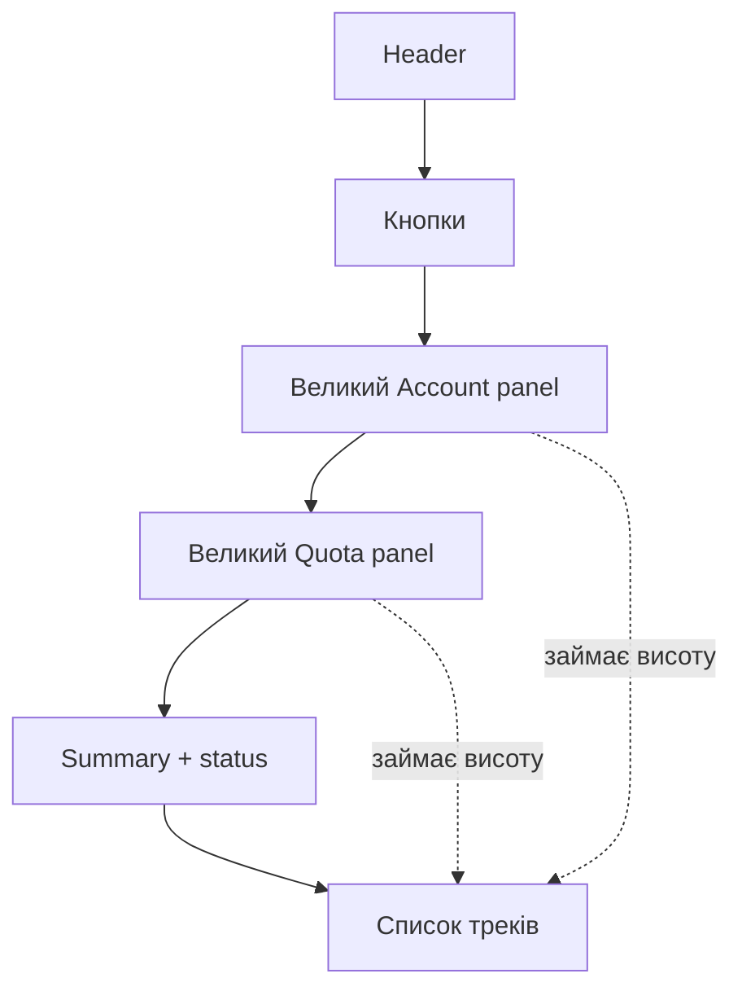
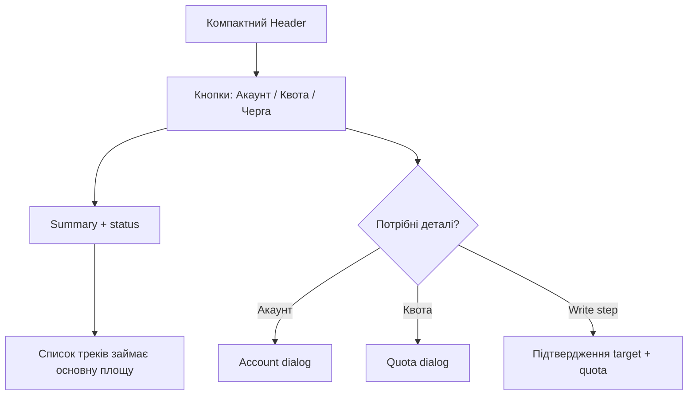

# v0.10.1 — Було / Стало: головний екран

## Було — v0.10.0

```mermaid
flowchart TD
    A[Header]
    --> B[Кнопки]
    --> C[Великий Account panel]
    --> D[Великий Quota panel]
    --> E[Summary + status]
    --> F[Список треків]

    C -. займає висоту .-> F
    D -. займає висоту .-> F
```

## Стало — v0.10.1

```mermaid
flowchart TD
    A[Компактний Header]
    --> B[Кнопки: Акаунт / Квота / Черга]
    --> C[Summary + status]
    --> D[Список треків займає основну площу]

    B --> E{Потрібні деталі?}
    E -->|Акаунт| F[Account dialog]
    E -->|Квота| G[Quota dialog]
    E -->|Write step| H[Підтвердження target + quota]
```
