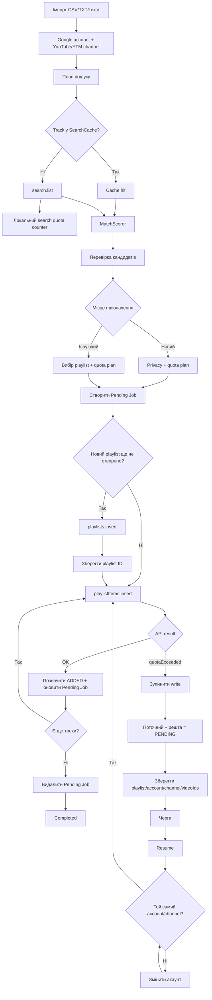

# YTM Importer v0.10.1 — Поточний процес

```mermaid
flowchart TD
    A[Імпорт CSV/TXT/текст]
    --> B[Google account + YouTube/YTM channel]
    --> C[План пошуку]

    C --> D{Track у SearchCache?}
    D -- Так --> E[Cache hit]
    D -- Ні --> F[search.list]
    F --> G[Локальний search quota counter]

    E --> H[MatchScorer]
    F --> H

    H --> I[Перевірка кандидатів]
    I --> J{Місце призначення}

    J -->|Новий| K[Privacy + quota plan]
    J -->|Існуючий| L[Вибір playlist + quota plan]

    K --> M[Створити Pending Job]
    L --> M

    M --> N{Новий playlist ще не створено?}
    N -- Так --> O[playlists.insert]
    O --> P[Зберегти playlist ID]
    N -- Ні --> Q[playlistItems.insert]
    P --> Q

    Q --> R{API result}
    R -- OK --> S[Позначити ADDED + оновити Pending Job]
    S --> T{Є ще треки?}
    T -- Так --> Q
    T -- Ні --> U[Видалити Pending Job]
    U --> V[Completed]

    R -- quotaExceeded --> W[Зупинити write]
    W --> X[Поточний + решта = PENDING]
    X --> Y[Зберегти playlist/account/channel/videoIds]
    Y --> Z[Черга]

    Z --> AA[Resume]
    AA --> AB{Той самий account/channel?}
    AB -- Ні --> AC[Змінити акаунт]
    AB -- Так --> Q
    AC --> AB
```
