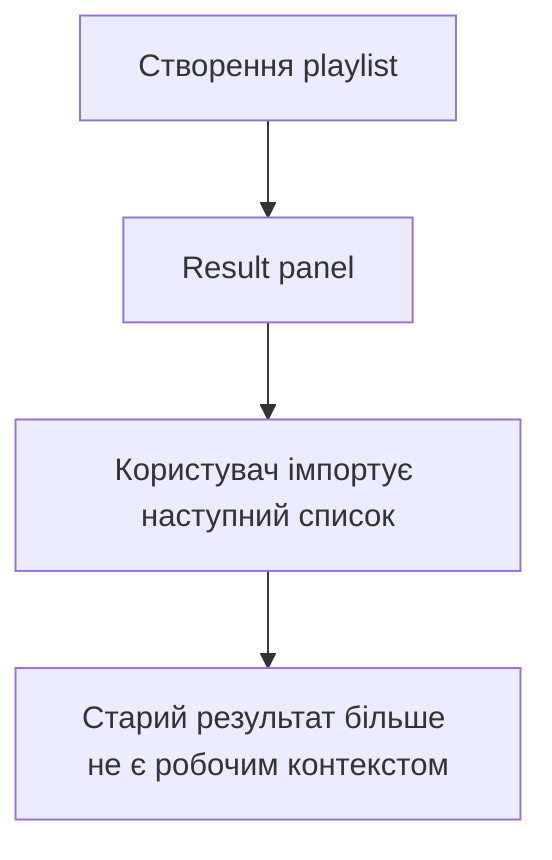
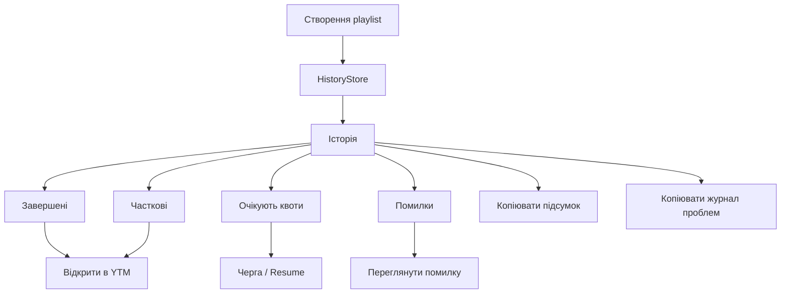

# v0.11.0 — Було / Стало

## Було — v0.10.1

```mermaid
flowchart TD
    A[Створення playlist]
    --> B[Result panel]
    --> C[Користувач імпортує наступний список]
    --> D[Старий результат більше не є робочим контекстом]
```

## Стало — v0.11.0

```mermaid
flowchart TD
    A[Створення playlist]
    --> B[HistoryStore]
    --> C[Історія]

    C --> D[Завершені]
    C --> E[Часткові]
    C --> F[Очікують квоти]
    C --> G[Помилки]

    D --> H[Відкрити в YTM]
    E --> H
    F --> I[Черга / Resume]
    G --> J[Переглянути помилку]

    C --> K[Копіювати підсумок]
    C --> L[Копіювати журнал проблем]
```
