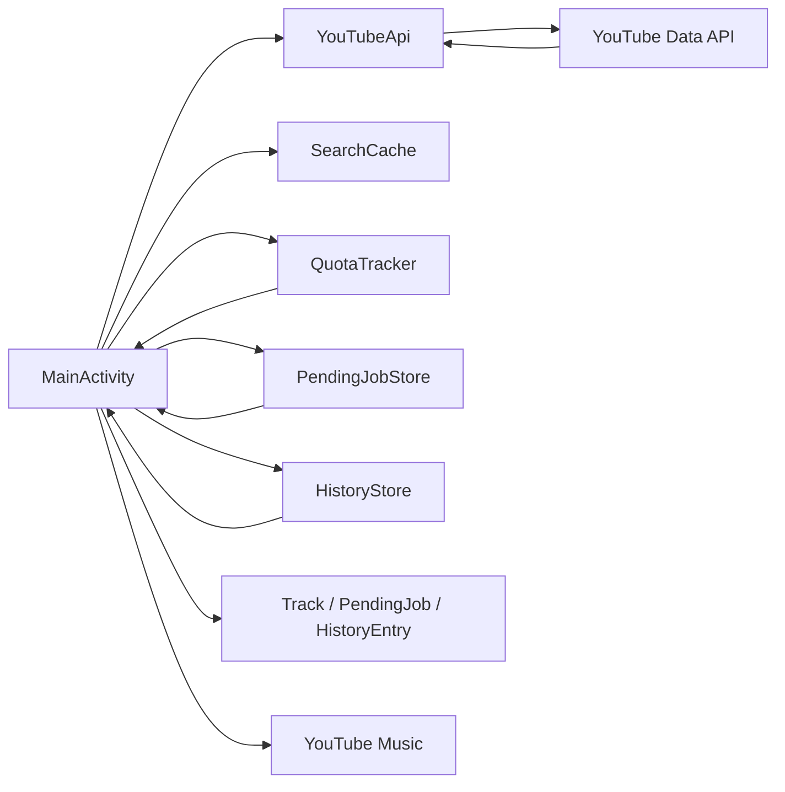

# YTM Importer v0.12.0 — Архітектура

## Нові файли

- `model/HistoryEntry.kt`
- `storage/HistoryStore.kt`

## Змінені моделі

- `Track` отримав `historyIndex`;
- `PendingTrack` зберігає `historyIndex`;
- `PendingJob` зберігає `sourceLabel`.
