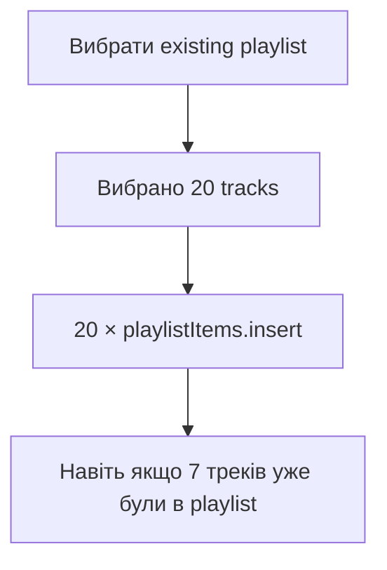
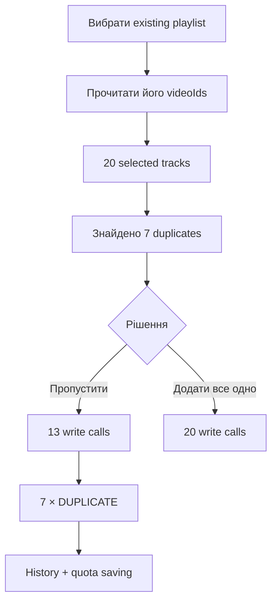

# v0.12.0 — Було / Стало

## Було — v0.11.0

```mermaid
flowchart TD
    A[Вибрати existing playlist]
    --> B[Вибрано 20 tracks]
    --> C[20 × playlistItems.insert]
    --> D[Навіть якщо 7 треків уже були в playlist]
```

## Стало — v0.12.0

```mermaid
flowchart TD
    A[Вибрати existing playlist]
    --> B[Прочитати його videoIds]
    --> C[20 selected tracks]
    --> D[Знайдено 7 duplicates]

    D --> E{Рішення}
    E -->|Пропустити| F[13 write calls]
    E -->|Додати все одно| G[20 write calls]

    F --> H[7 × DUPLICATE]
    H --> I[History + quota saving]
```
