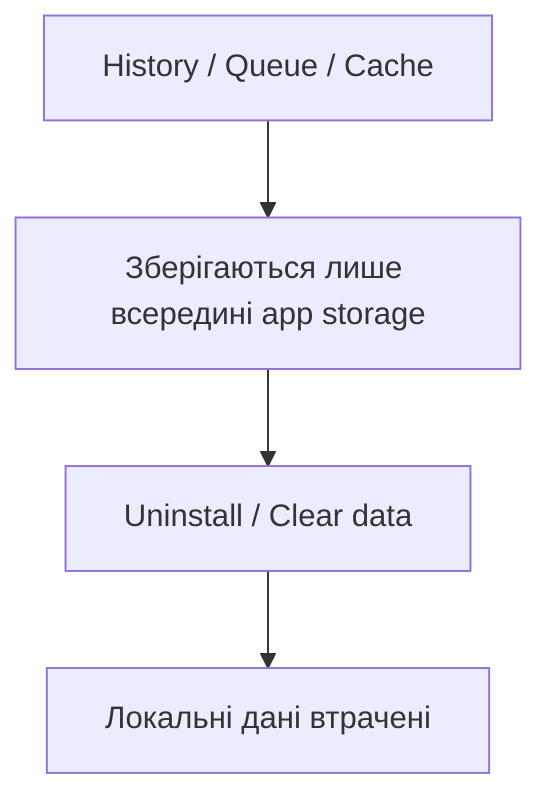
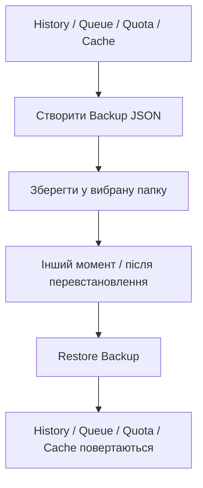

# v0.13.0 — Було / Стало

## Було — v0.12.0

```mermaid
flowchart TD
    A[History / Queue / Cache]
    --> B[Зберігаються лише всередині app storage]
    --> C[Uninstall / Clear data]
    --> D[Локальні дані втрачені]
```

## Стало — v0.13.0

```mermaid
flowchart TD
    A[History / Queue / Quota / Cache]
    --> B[Створити Backup JSON]
    --> C[Зберегти у вибрану папку]

    C --> D[Інший момент / після перевстановлення]
    D --> E[Restore Backup]
    E --> F[History / Queue / Quota / Cache повертаються]
```
