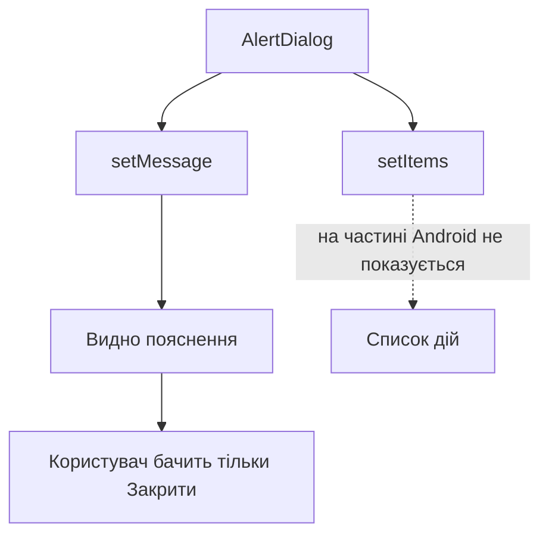
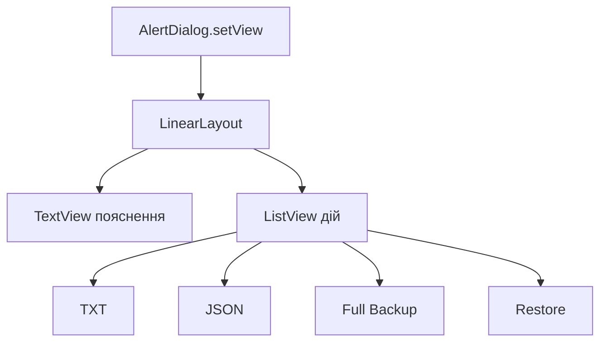

# v0.13.1 — Було / Стало

## Було — v0.13.0

```mermaid
flowchart TD
    A[AlertDialog]
    --> B[setMessage]
    A --> C[setItems]

    B --> D[Видно пояснення]
    C -. на частині Android не показується .-> E[Список дій]

    D --> F[Користувач бачить тільки Закрити]
```

## Стало — v0.13.1

```mermaid
flowchart TD
    A[AlertDialog.setView]
    --> B[LinearLayout]
    B --> C[TextView пояснення]
    B --> D[ListView дій]

    D --> E[TXT]
    D --> F[JSON]
    D --> G[Full Backup]
    D --> H[Restore]
```
