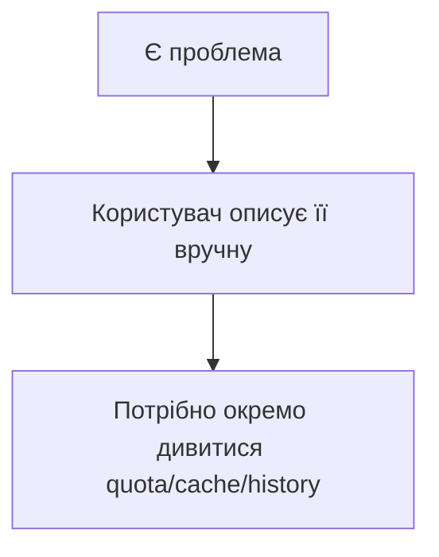
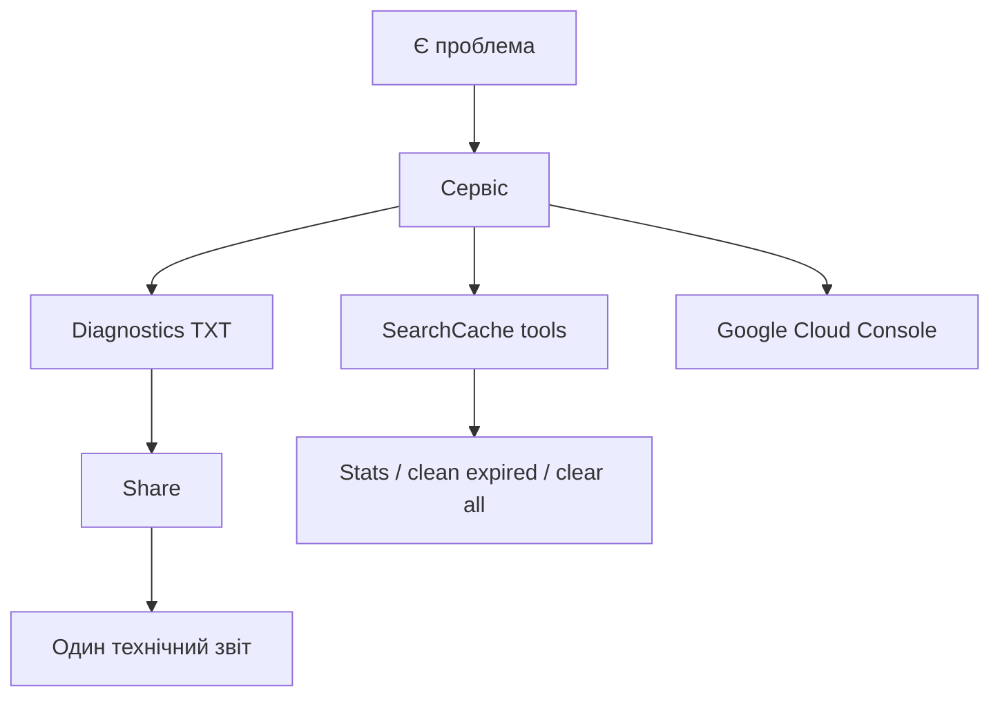

# v0.14.0 — Було / Стало

## Було — v0.13.1

```mermaid
flowchart TD
    A[Є проблема]
    --> B[Користувач описує її вручну]
    --> C[Потрібно окремо дивитися quota/cache/history]
```

## Стало — v0.14.0

```mermaid
flowchart TD
    A[Є проблема]
    --> B[Сервіс]
    --> C[Diagnostics TXT]
    --> D[Share]
    --> E[Один технічний звіт]

    B --> F[SearchCache tools]
    F --> G[Stats / clean expired / clear all]

    B --> H[Google Cloud Console]
```
