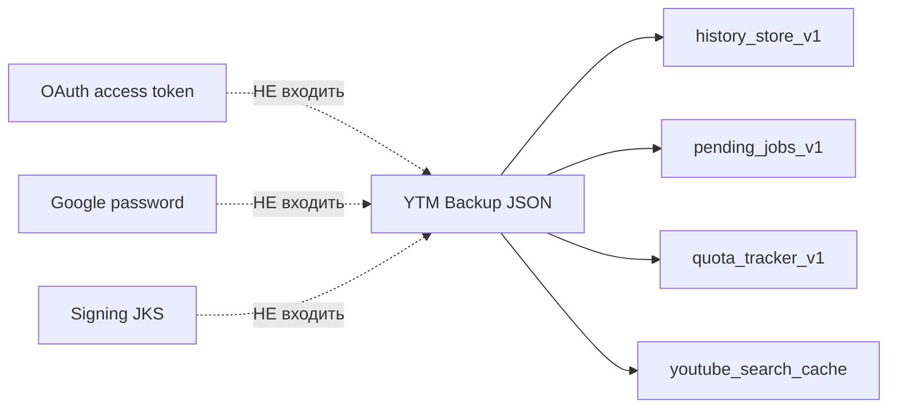

# v0.15.0 — Що входить у backup

```mermaid
flowchart LR
    BACKUP[YTM Backup JSON]

    BACKUP --> H[history_store_v1]
    BACKUP --> P[pending_jobs_v1]
    BACKUP --> Q[quota_tracker_v1]
    BACKUP --> C[youtube_search_cache]

    X[OAuth access token]
    Y[Google password]
    Z[Signing JKS]

    X -. НЕ входить .-> BACKUP
    Y -. НЕ входить .-> BACKUP
    Z -. НЕ входить .-> BACKUP
```

## Приватність

History може містити Google email та YouTube Channel ID.
Тому backup не слід публікувати у GitHub.
