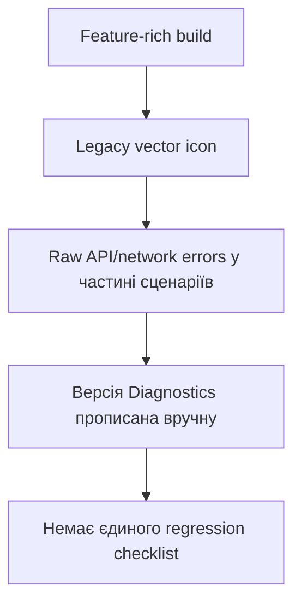
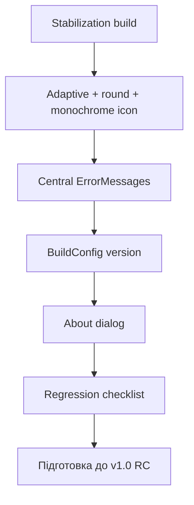

# v0.15.0 — Було / Стало

## Було — v0.14.0

```mermaid
flowchart TD
    A[Feature-rich build]
    --> B[Legacy vector icon]
    --> C[Raw API/network errors у частині сценаріїв]
    --> D[Версія Diagnostics прописана вручну]
    --> E[Немає єдиного regression checklist]
```

## Стало — v0.15.0

```mermaid
flowchart TD
    A[Stabilization build]
    --> B[Adaptive + round + monochrome icon]
    --> C[Central ErrorMessages]
    --> D[BuildConfig version]
    --> E[About dialog]
    --> F[Regression checklist]
    --> G[Підготовка до v1.0 RC]
```
