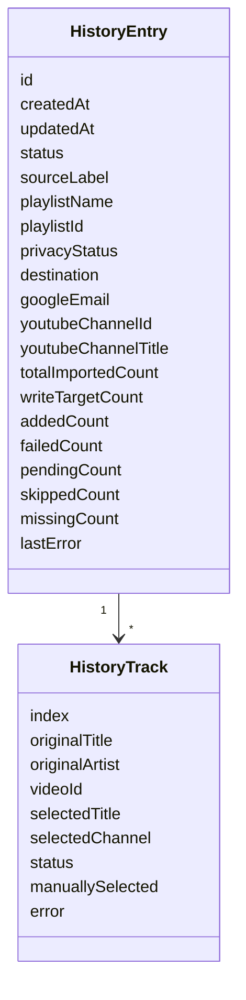

# v0.15.0 — Дані History Entry

```mermaid
classDiagram
    class HistoryEntry {
        id
        createdAt
        updatedAt
        status
        sourceLabel
        playlistName
        playlistId
        privacyStatus
        destination
        googleEmail
        youtubeChannelId
        youtubeChannelTitle
        totalImportedCount
        writeTargetCount
        addedCount
        failedCount
        pendingCount
        skippedCount
        missingCount
        lastError
    }

    class HistoryTrack {
        index
        originalTitle
        originalArtist
        videoId
        selectedTitle
        selectedChannel
        status
        manuallySelected
        error
    }

    HistoryEntry "1" --> "*" HistoryTrack
```

`historyIndex` дозволяє правильно оновлювати той самий трек після Resume,
навіть якщо в поточному екрані залишилися тільки невиконані треки.
