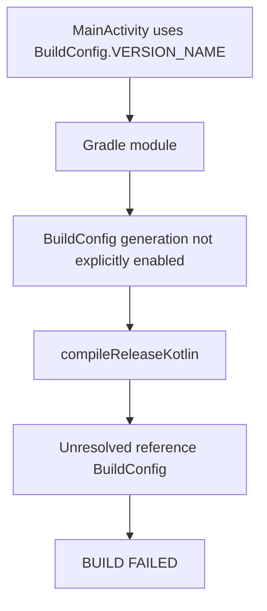
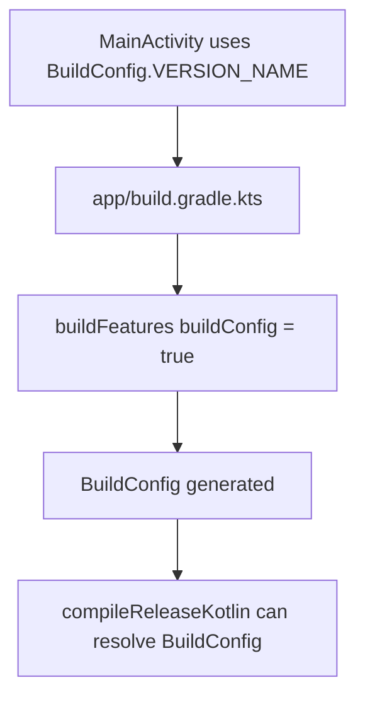

# v0.15.1 — Було / Стало

## Було — v0.15.0

```mermaid
flowchart TD
    A[MainActivity uses BuildConfig.VERSION_NAME]
    --> B[Gradle module]
    B --> C[BuildConfig generation not explicitly enabled]
    C --> D[compileReleaseKotlin]
    D --> E[Unresolved reference BuildConfig]
    E --> F[BUILD FAILED]
```

## Стало — v0.15.1

```mermaid
flowchart TD
    A[MainActivity uses BuildConfig.VERSION_NAME]
    --> B[app/build.gradle.kts]
    B --> C[buildFeatures buildConfig = true]
    C --> D[BuildConfig generated]
    D --> E[compileReleaseKotlin can resolve BuildConfig]
```
