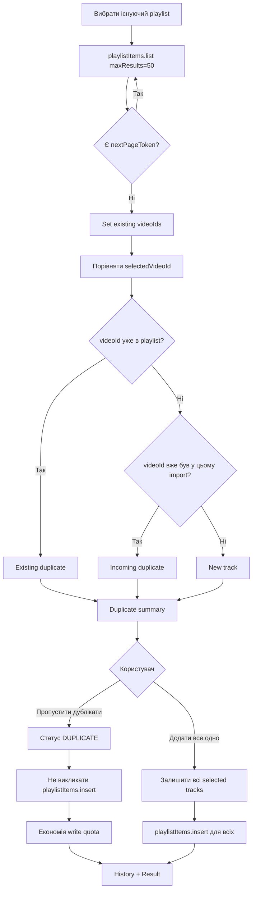

# v0.15.1 — Перевірка дублікатів

```mermaid
flowchart TD
    A[Вибрати існуючий playlist]
    --> B[playlistItems.list maxResults=50]
    --> C{Є nextPageToken?}

    C -- Так --> B
    C -- Ні --> D[Set existing videoIds]

    D --> E[Порівняти selectedVideoId]

    E --> F{videoId уже в playlist?}
    F -- Так --> G[Existing duplicate]
    F -- Ні --> H{videoId вже був у цьому import?}

    H -- Так --> I[Incoming duplicate]
    H -- Ні --> J[New track]

    G --> K[Duplicate summary]
    I --> K
    J --> K

    K --> L{Користувач}

    L -->|Пропустити дублікати| M[Статус DUPLICATE]
    M --> N[Не викликати playlistItems.insert]
    N --> O[Економія write quota]

    L -->|Додати все одно| P[Залишити всі selected tracks]
    P --> Q[playlistItems.insert для всіх]

    O --> R[History + Result]
    Q --> R
```
