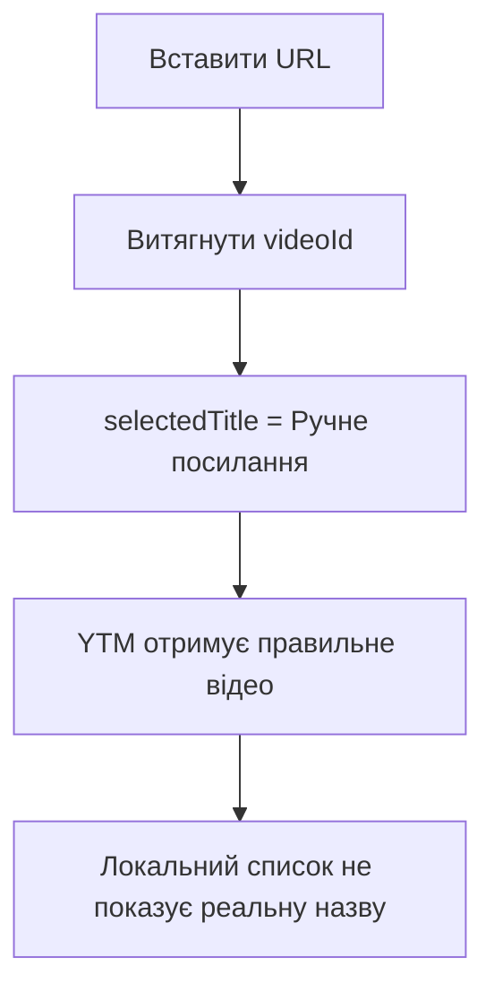
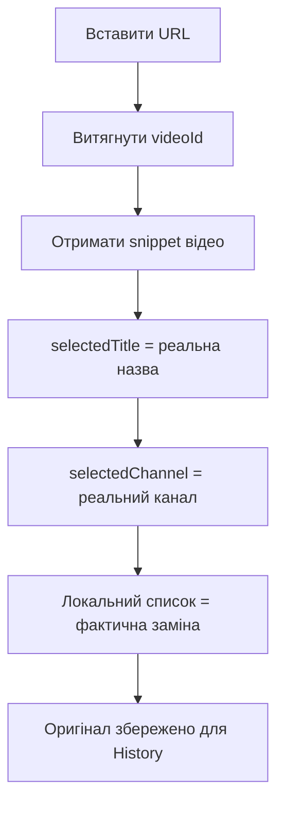

# v0.15.2 — Було / Стало

## Було

```mermaid
flowchart TD
    A[Вставити URL]
    --> B[Витягнути videoId]
    --> C[selectedTitle = Ручне посилання]
    --> D[YTM отримує правильне відео]
    --> E[Локальний список не показує реальну назву]
```

## Стало

```mermaid
flowchart TD
    A[Вставити URL]
    --> B[Витягнути videoId]
    --> C[Отримати snippet відео]
    --> D[selectedTitle = реальна назва]
    --> E[selectedChannel = реальний канал]
    --> F[Локальний список = фактична заміна]
    --> G[Оригінал збережено для History]
```
