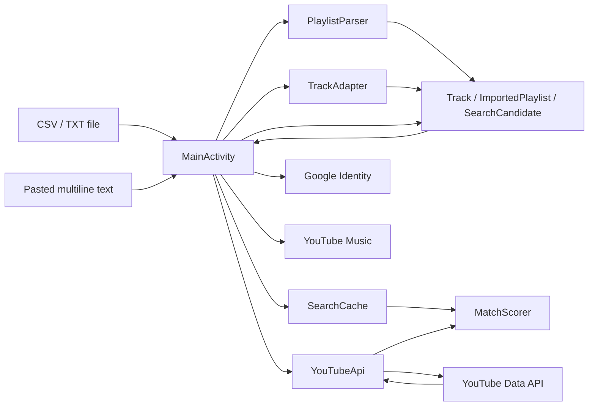

# YTM Importer v0.8.0 — Architecture

```mermaid
flowchart LR
    FILE[CSV / TXT file]
    TEXT[Pasted multiline text]
    UI[MainActivity]
    PARSER[PlaylistParser]
    MODEL[Track / ImportedPlaylist / SearchCandidate]
    ADAPTER[TrackAdapter]
    CACHE[SearchCache]
    SCORE[MatchScorer]
    API[YouTubeApi]
    AUTH[Google Identity]
    YT[YouTube Data API]
    YTM[YouTube Music]

    FILE --> UI
    TEXT --> UI
    UI --> PARSER
    PARSER --> MODEL

    UI --> ADAPTER
    ADAPTER --> MODEL
    UI --> MODEL
    MODEL --> UI

    UI --> AUTH
    UI --> CACHE
    UI --> API

    CACHE --> SCORE
    API --> SCORE
    API --> YT
    YT --> API

    UI --> YTM
```
