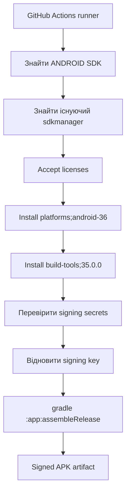

# v0.8.0 — GitHub Actions build hotfix

## Було

`android-actions/setup-android@v3` запускав `sdkmanager tools`.

Пакет `tools` більше не доступний у поточному Android SDK repository, тому workflow падав ще до встановлення API 36.

```mermaid
flowchart TD
    A[GitHub Actions runner]
    --> B[android-actions/setup-android@v3]
    --> C[sdkmanager tools]
    --> D[Failed to find package tools]
    --> E[Workflow FAILED]

    E -. не запускається .-> F[Install Android SDK 36]
    E -. не запускається .-> G[Signing]
    E -. не запускається .-> H[Build APK]
```

## Стало

GitHub-hosted Ubuntu runner уже має Android SDK.
Workflow знаходить наявний `sdkmanager` і встановлює тільки потрібні пакети.



## Зміна

Видалено крок:

`uses: android-actions/setup-android@v3`

Він замінений на локалізацію Android SDK, який уже є на GitHub-hosted runner.
