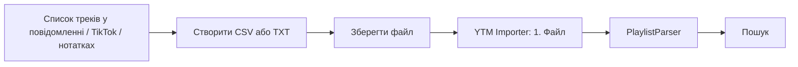
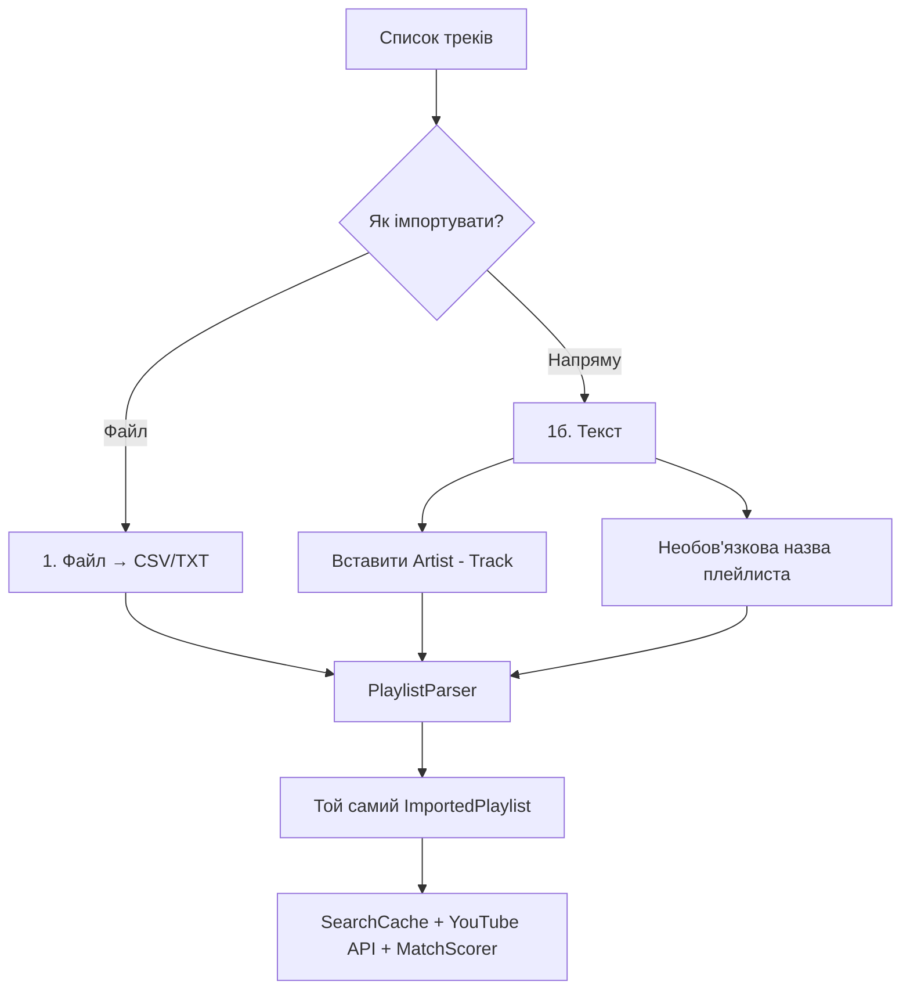

# v0.8.0 — Було / Стало

## Було — v0.7.1

Треки спочатку треба було підготувати як файл.

```mermaid
flowchart LR
    A[Список треків у повідомленні / TikTok / нотатках]
    --> B[Створити CSV або TXT]
    --> C[Зберегти файл]
    --> D[YTM Importer: 1. Файл]
    --> E[PlaylistParser]
    --> F[Пошук]
```

## Стало — v0.8.0

Файл залишається доступним, але тепер є коротший шлях.

```mermaid
flowchart TD
    A[Список треків]

    A --> B{Як імпортувати?}

    B -->|Файл| C[1. Файл → CSV/TXT]
    B -->|Напряму| D[1б. Текст]

    D --> E[Вставити Artist - Track]
    D --> F[Необов'язкова назва плейлиста]

    C --> G[PlaylistParser]
    E --> G
    F --> G

    G --> H[Той самий ImportedPlaylist]
    H --> I[SearchCache + YouTube API + MatchScorer]
```
