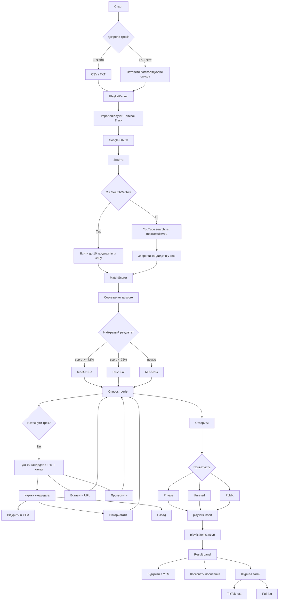

# YTM Importer v0.8.0 — Current Flow

```mermaid
flowchart TD
    A[Старт] --> B{Джерело треків}

    B -->|1. Файл| C[CSV / TXT]
    B -->|1б. Текст| D[Вставити багаторядковий список]

    C --> E[PlaylistParser]
    D --> E

    E --> F[ImportedPlaylist + список Track]
    F --> G[Google OAuth]
    G --> H[Знайти]

    H --> I{Є в SearchCache?}
    I -- Так --> J[Взяти до 10 кандидатів із кешу]
    I -- Ні --> K[YouTube search.list maxResults=10]
    K --> L[Зберегти кандидатів у кеш]

    J --> M[MatchScorer]
    L --> M
    M --> N[Сортування за score]

    N --> O{Найкращий результат}
    O -->|score >= 72%| P[MATCHED]
    O -->|score < 72%| Q[REVIEW]
    O -->|немає| R[MISSING]

    P --> S[Список треків]
    Q --> S
    R --> S

    S --> T{Натиснути трек?}
    T -- Так --> U[До 10 кандидатів + % + канал]
    U --> V[Картка кандидата]
    V --> W[Відкрити в YTM]
    V --> X[Використати]
    V --> Y[Назад]
    U --> Z[Вставити URL]
    U --> AA[Пропустити]

    X --> S
    Z --> S
    AA --> S

    S --> AB[Створити]
    AB --> AC{Приватність}
    AC --> AD[Private]
    AC --> AE[Unlisted]
    AC --> AF[Public]

    AD --> AG[playlists.insert]
    AE --> AG
    AF --> AG
    AG --> AH[playlistItems.insert]
    AH --> AI[Result panel]

    AI --> AJ[Відкрити в YTM]
    AI --> AK[Копіювати посилання]
    AI --> AL[Журнал замін]
    AL --> AM[TikTok text]
    AL --> AN[Full log]
```
