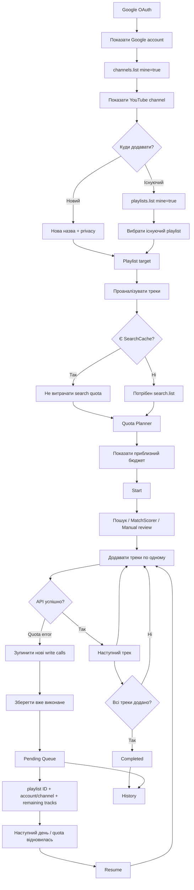

# YTM Importer — Future Roadmap after v0.8.0

Ця діаграма показує заплановану логіку наступних етапів. Це **не поточна реалізація**.

## Важлива логіка

- Новий плейлист і додавання до існуючого — два рівноправні режими.
- Pending job завжди прив'язаний до конкретного playlist ID і конкретного YouTube channel.
- При quota error вже додані треки не видаляються.
- Resume додає тільки залишок.
- Відображення quota в застосунку буде **оцінкою**, якщо воно базується тільки на локальних операціях цього телефона.
