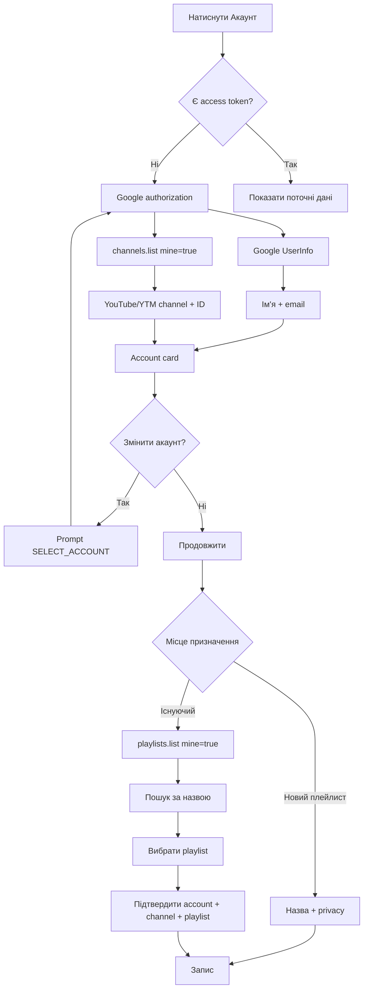

# v0.9.0 — Акаунт і місце призначення

```mermaid
flowchart TD
    A[Натиснути Акаунт]
    --> B{Є access token?}

    B -- Ні --> C[Google authorization]
    B -- Так --> D[Показати поточні дані]

    C --> E[Google UserInfo]
    C --> F[channels.list mine=true]

    E --> G[Ім'я + email]
    F --> H[YouTube/YTM channel + ID]

    G --> I[Account card]
    H --> I

    I --> J{Змінити акаунт?}
    J -- Так --> K[Prompt SELECT_ACCOUNT]
    K --> C
    J -- Ні --> L[Продовжити]

    L --> M{Місце призначення}

    M -->|Новий плейлист| N[Назва + privacy]
    M -->|Існуючий| O[playlists.list mine=true]

    O --> P[Пошук за назвою]
    P --> Q[Вибрати playlist]
    Q --> R[Підтвердити account + channel + playlist]

    N --> S[Запис]
    R --> S
```
