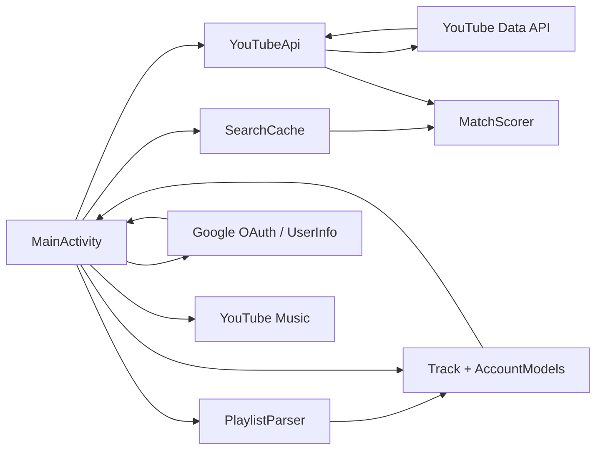

# YTM Importer v0.9.0 — Архітектура

## Новий файл моделі

`app/src/main/java/com/saney/ytmimporter/model/AccountModels.kt`

Містить:

- `GoogleAccountInfo`;
- `YouTubeChannelInfo`;
- `YouTubePlaylistInfo`.
