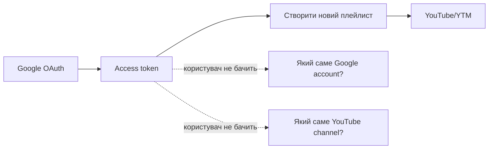
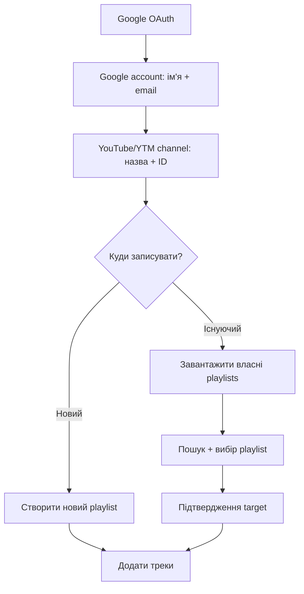

# v0.9.0 — Було / Стало

## Було — v0.8.0

```mermaid
flowchart LR
    A[Google OAuth]
    --> B[Access token]
    --> C[Створити новий плейлист]
    --> D[YouTube/YTM]

    B -. користувач не бачить .-> E[Який саме Google account?]
    B -. користувач не бачить .-> F[Який саме YouTube channel?]
```

## Стало — v0.9.0

```mermaid
flowchart TD
    A[Google OAuth]
    --> B[Google account: ім'я + email]
    --> C[YouTube/YTM channel: назва + ID]

    C --> D{Куди записувати?}

    D -->|Новий| E[Створити новий playlist]
    D -->|Існуючий| F[Завантажити власні playlists]

    F --> G[Пошук + вибір playlist]
    G --> H[Підтвердження target]

    E --> I[Додати треки]
    H --> I
```
