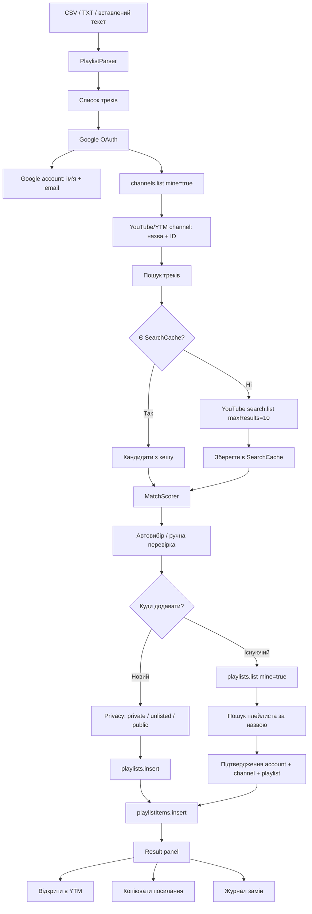

# YTM Importer v0.9.0 — Поточний процес

```mermaid
flowchart TD
    A[CSV / TXT / вставлений текст]
    --> B[PlaylistParser]
    --> C[Список треків]

    C --> D[Google OAuth]
    D --> E[Google account: ім'я + email]
    D --> F[channels.list mine=true]
    F --> G[YouTube/YTM channel: назва + ID]

    G --> H[Пошук треків]
    H --> I{Є SearchCache?}

    I -- Так --> J[Кандидати з кешу]
    I -- Ні --> K[YouTube search.list maxResults=10]
    K --> L[Зберегти в SearchCache]

    J --> M[MatchScorer]
    L --> M
    M --> N[Автовибір / ручна перевірка]

    N --> O{Куди додавати?}

    O -->|Новий| P[Privacy: private / unlisted / public]
    P --> Q[playlists.insert]
    Q --> R[playlistItems.insert]

    O -->|Існуючий| S[playlists.list mine=true]
    S --> T[Пошук плейлиста за назвою]
    T --> U[Підтвердження account + channel + playlist]
    U --> R

    R --> V[Result panel]
    V --> W[Відкрити в YTM]
    V --> X[Копіювати посилання]
    V --> Y[Журнал замін]
```
