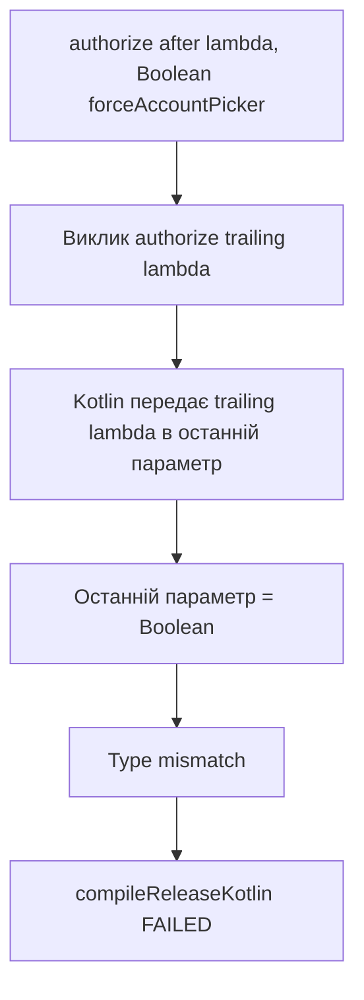
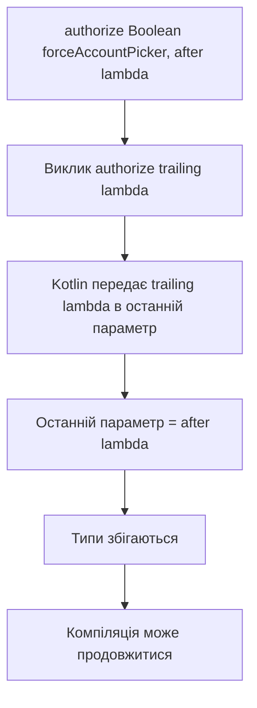

# v0.9.1 — Було / Стало: authorize compile hotfix

## Було — v0.9.0

```mermaid
flowchart TD
    A[authorize after lambda, Boolean forceAccountPicker]
    --> B[Виклик authorize trailing lambda]
    --> C[Kotlin передає trailing lambda в останній параметр]
    --> D[Останній параметр = Boolean]
    --> E[Type mismatch]
    --> F[compileReleaseKotlin FAILED]
```

## Стало — v0.9.1

```mermaid
flowchart TD
    A[authorize Boolean forceAccountPicker, after lambda]
    --> B[Виклик authorize trailing lambda]
    --> C[Kotlin передає trailing lambda в останній параметр]
    --> D[Останній параметр = after lambda]
    --> E[Типи збігаються]
    --> F[Компіляція може продовжитися]
```
