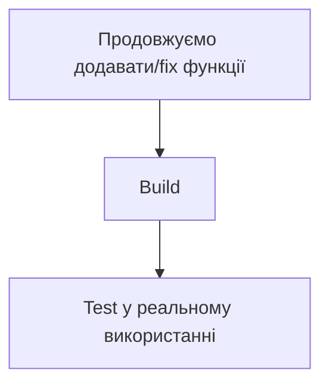
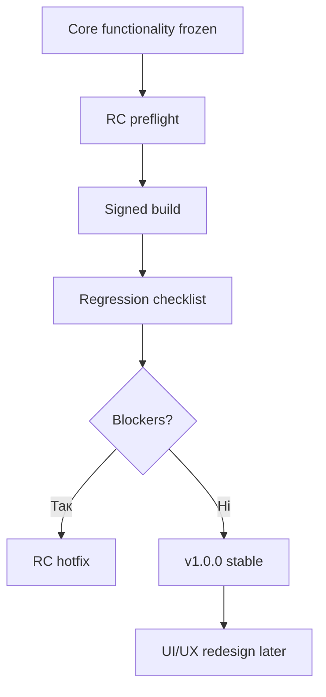

# v1.0.0-rc1 — Було / Стало

## Було — v0.15.2

```mermaid
flowchart TD
    A[Продовжуємо додавати/fix функції]
    --> B[Build]
    --> C[Test у реальному використанні]
```

## Стало — v1.0.0-rc1

```mermaid
flowchart TD
    A[Core functionality frozen]
    --> B[RC preflight]
    --> C[Signed build]
    --> D[Regression checklist]
    --> E{Blockers?}

    E -- Так --> F[RC hotfix]
    E -- Ні --> G[v1.0.0 stable]

    G --> H[UI/UX redesign later]
```
