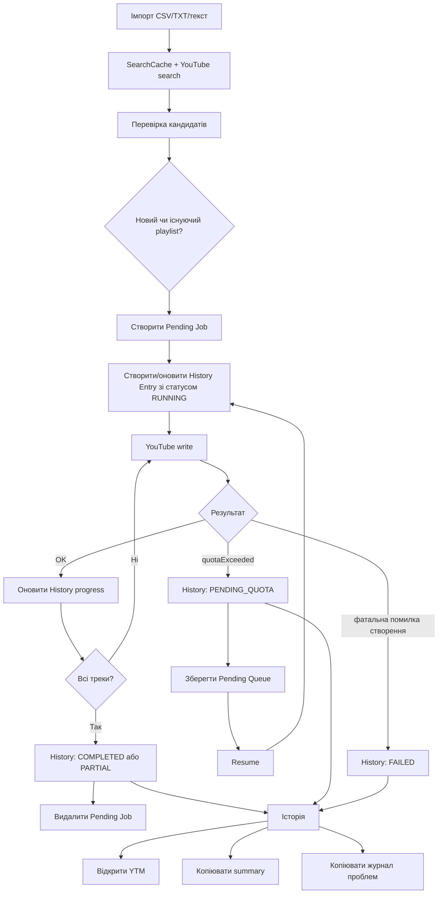

# YTM Importer v1.0.0-rc1 — Поточний процес

```mermaid
flowchart TD
    A[Імпорт CSV/TXT/текст]
    --> B[SearchCache + YouTube search]
    --> C[Перевірка кандидатів]
    --> D{Новий чи існуючий playlist?}

    D --> E[Створити Pending Job]
    E --> F[Створити/оновити History Entry зі статусом RUNNING]

    F --> G[YouTube write]
    G --> H{Результат}

    H -->|OK| I[Оновити History progress]
    I --> J{Всі треки?}
    J -- Ні --> G
    J -- Так --> K[History: COMPLETED або PARTIAL]
    K --> L[Видалити Pending Job]

    H -->|quotaExceeded| M[History: PENDING_QUOTA]
    M --> N[Зберегти Pending Queue]
    N --> O[Resume]
    O --> F

    H -->|фатальна помилка створення| P[History: FAILED]

    K --> Q[Історія]
    M --> Q
    P --> Q

    Q --> R[Відкрити YTM]
    Q --> S[Копіювати summary]
    Q --> T[Копіювати журнал проблем]
```
