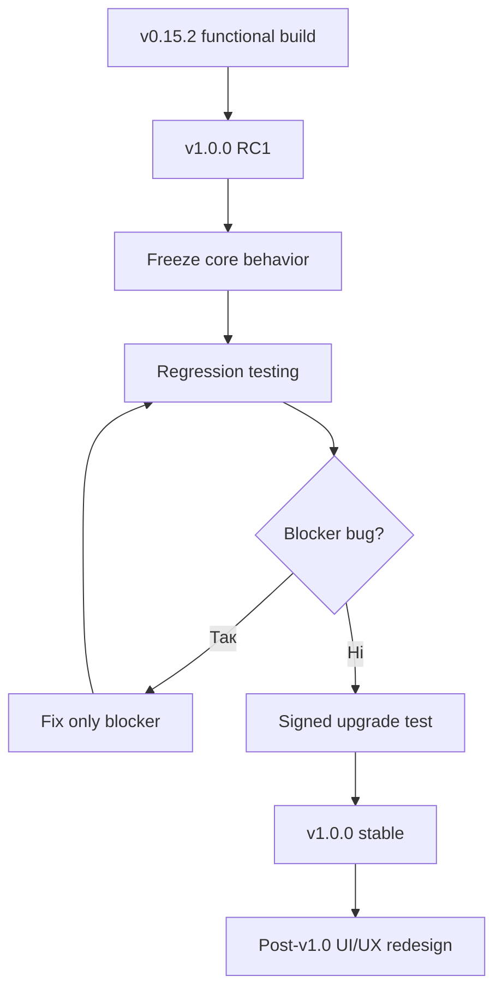

# v1.0.0-rc1 — Core freeze

```mermaid
flowchart TD
    A[v0.15.2 functional build]
    --> B[v1.0.0 RC1]

    B --> C[Freeze core behavior]
    C --> D[Regression testing]

    D --> E{Blocker bug?}
    E -- Так --> F[Fix only blocker]
    F --> D

    E -- Ні --> G[Signed upgrade test]
    G --> H[v1.0.0 stable]

    H --> I[Post-v1.0 UI/UX redesign]
```
