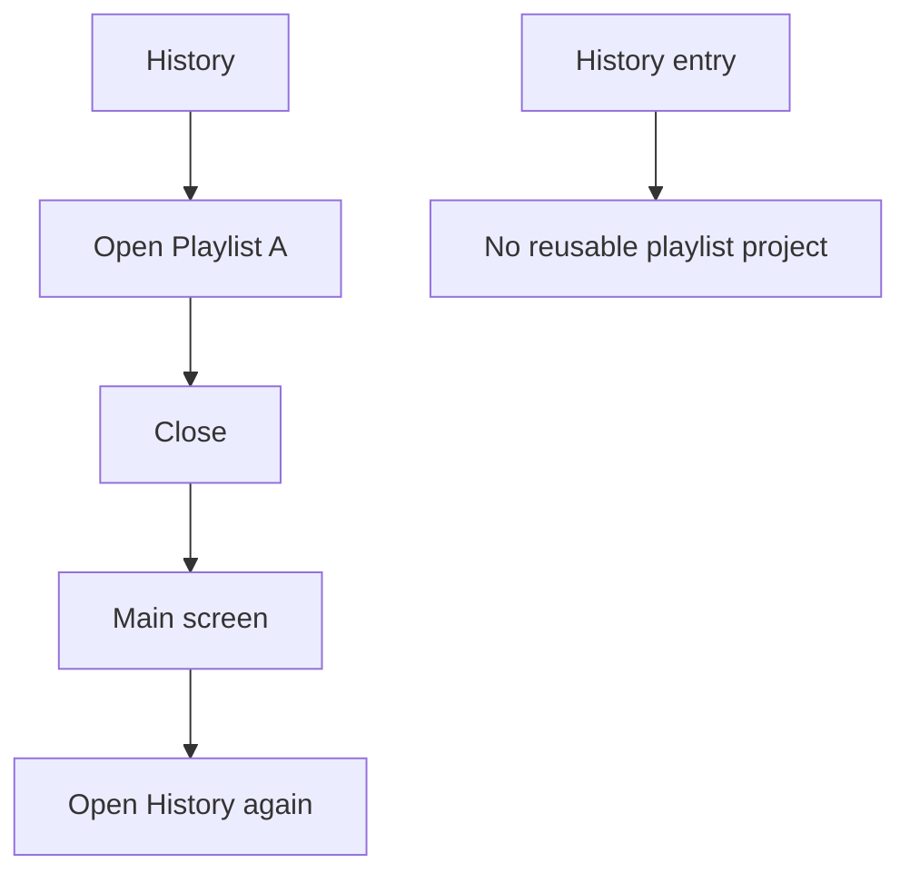
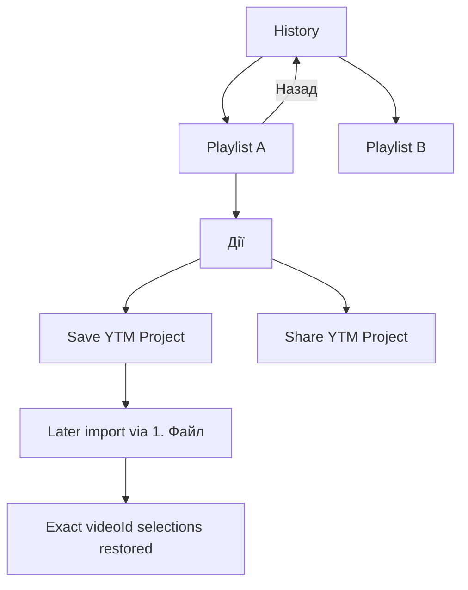

# v1.0.0-rc2 — Було / Стало

## Було — RC1

```mermaid
flowchart TD
    A[History]
    --> B[Open Playlist A]
    --> C[Close]
    --> D[Main screen]
    --> E[Open History again]

    F[History entry]
    --> G[No reusable playlist project]
```

## Стало — RC2

```mermaid
flowchart TD
    A[History]
    --> B[Playlist A]
    B -->|Назад| A
    A --> C[Playlist B]

    B --> D[Дії]
    D --> E[Save YTM Project]
    D --> F[Share YTM Project]

    E --> G[Later import via 1. Файл]
    G --> H[Exact videoId selections restored]
```
