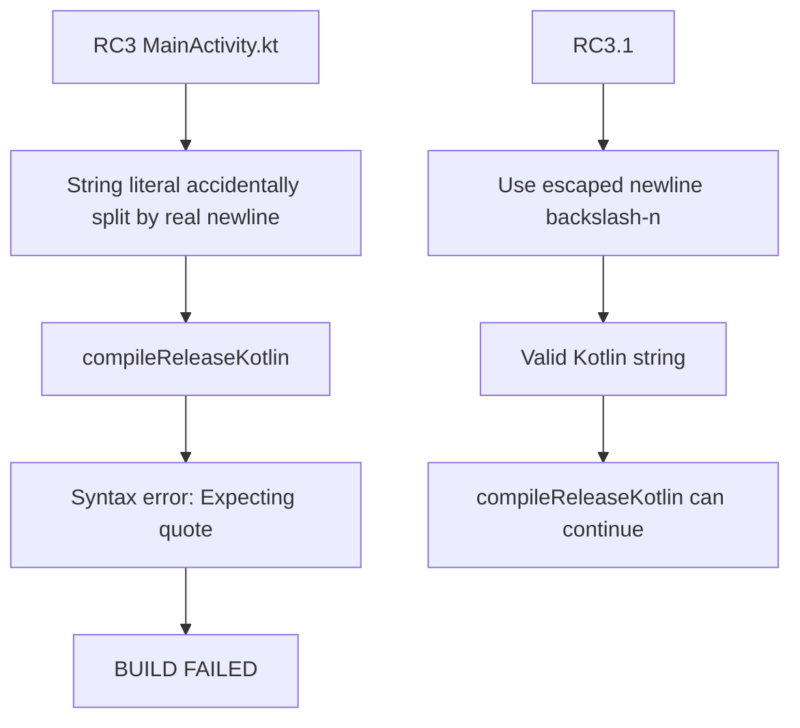

# v1.0.0-rc3.1 — Build syntax hotfix

```mermaid
flowchart TD
    A[RC3 MainActivity.kt]
    --> B[String literal accidentally split by real newline]
    --> C[compileReleaseKotlin]
    --> D[Syntax error: Expecting quote]
    --> E[BUILD FAILED]

    F[RC3.1]
    --> G[Use escaped newline backslash-n]
    --> H[Valid Kotlin string]
    --> I[compileReleaseKotlin can continue]
```
