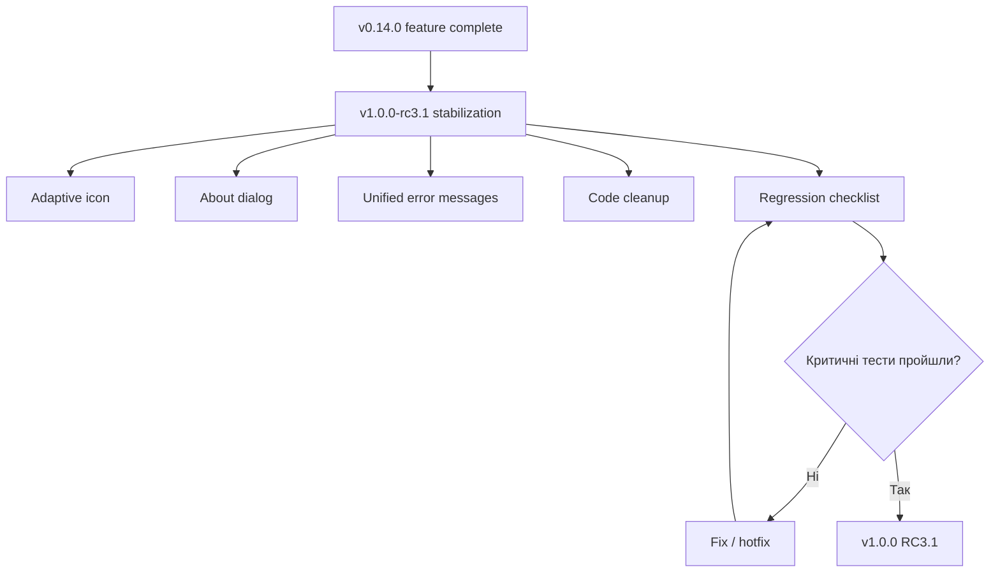

# v1.0.0-rc3.1 — Підготовка Release Candidate

```mermaid
flowchart TD
    A[v0.14.0 feature complete]
    --> B[v1.0.0-rc3.1 stabilization]

    B --> C[Adaptive icon]
    B --> D[About dialog]
    B --> E[Unified error messages]
    B --> F[Code cleanup]
    B --> G[Regression checklist]

    G --> H{Критичні тести пройшли?}
    H -- Ні --> I[Fix / hotfix]
    I --> G
    H -- Так --> J[v1.0.0 RC3.1]
```
