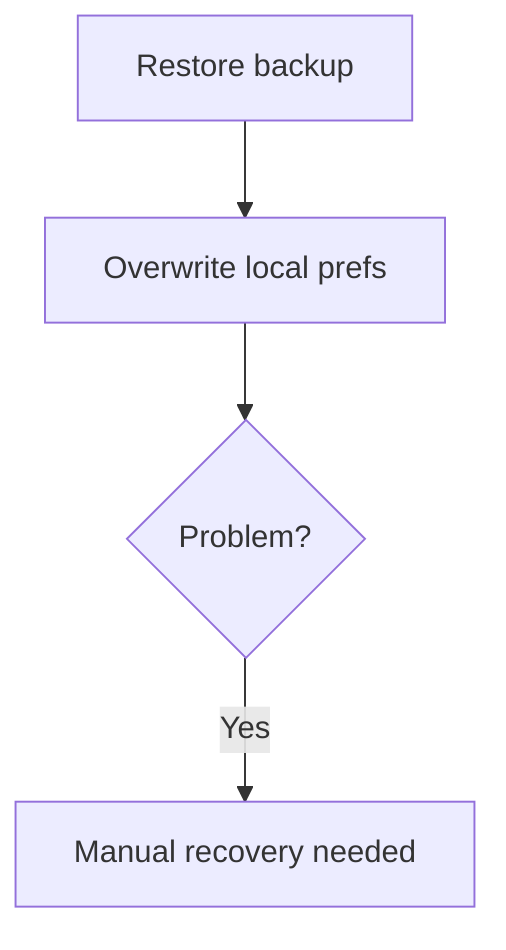
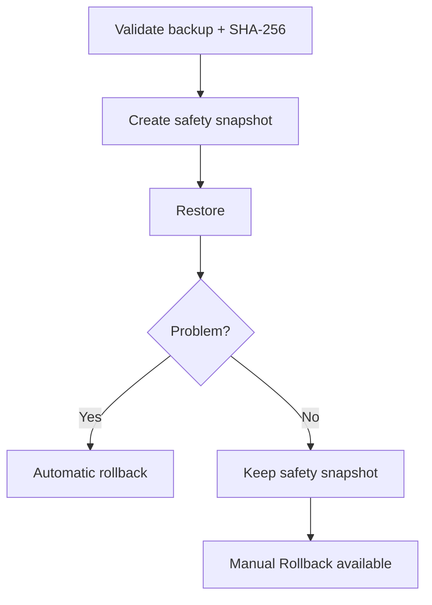

# v1.0.0-rc3 — Було / Стало

## Було — RC2

```mermaid
flowchart TD
    A[Restore backup]
    --> B[Overwrite local prefs]
    --> C{Problem?}
    C -- Yes --> D[Manual recovery needed]
```

## Стало — RC3

```mermaid
flowchart TD
    A[Validate backup + SHA-256]
    --> B[Create safety snapshot]
    --> C[Restore]
    --> D{Problem?}

    D -- Yes --> E[Automatic rollback]
    D -- No --> F[Keep safety snapshot]
    F --> G[Manual Rollback available]
```
