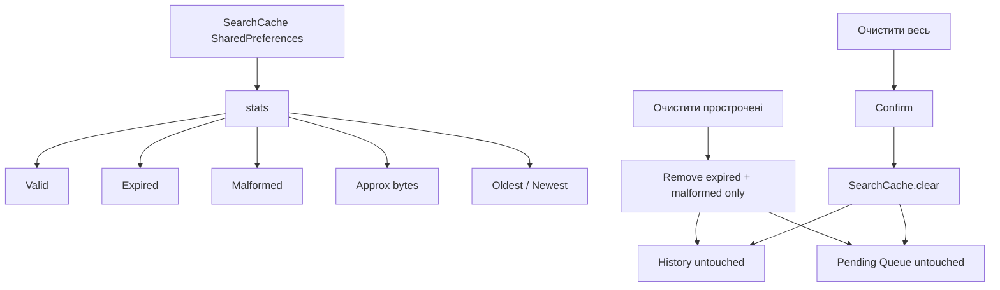

# v1.0.0-rc3 — SearchCache tools

```mermaid
flowchart TD
    A[SearchCache SharedPreferences]
    --> B[stats]

    B --> C[Valid]
    B --> D[Expired]
    B --> E[Malformed]
    B --> F[Approx bytes]
    B --> G[Oldest / Newest]

    H[Очистити прострочені]
    --> I[Remove expired + malformed only]

    J[Очистити весь]
    --> K[Confirm]
    --> L[SearchCache.clear]

    I --> M[History untouched]
    L --> M
    I --> N[Pending Queue untouched]
    L --> N
```
