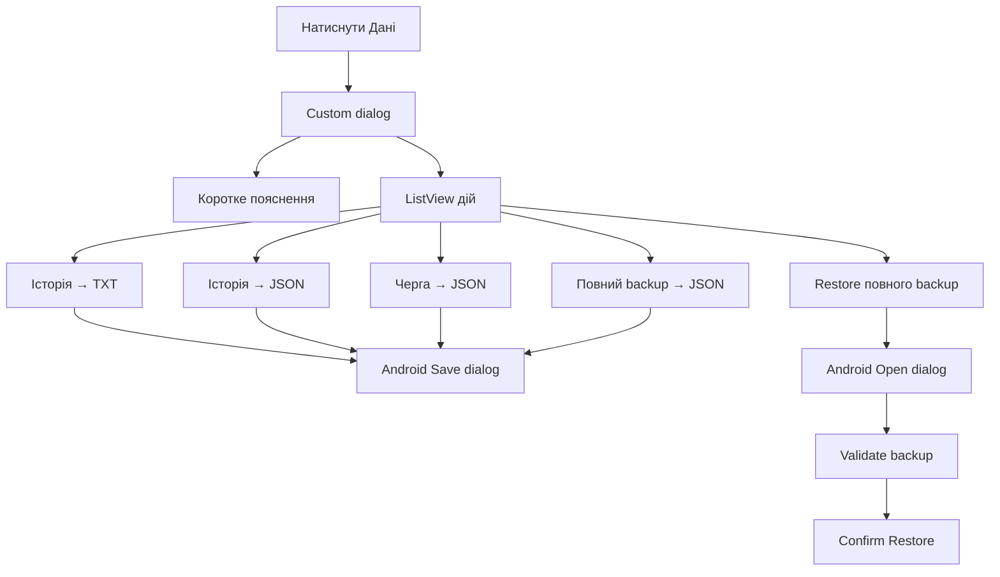

# v1.0.0-rc3 — Меню Дані

```mermaid
flowchart TD
    A[Натиснути Дані]
    --> B[Custom dialog]

    B --> C[Коротке пояснення]
    B --> D[ListView дій]

    D --> E[Історія → TXT]
    D --> F[Історія → JSON]
    D --> G[Черга → JSON]
    D --> H[Повний backup → JSON]
    D --> I[Restore повного backup]

    E --> J[Android Save dialog]
    F --> J
    G --> J
    H --> J

    I --> K[Android Open dialog]
    K --> L[Validate backup]
    L --> M[Confirm Restore]
```
