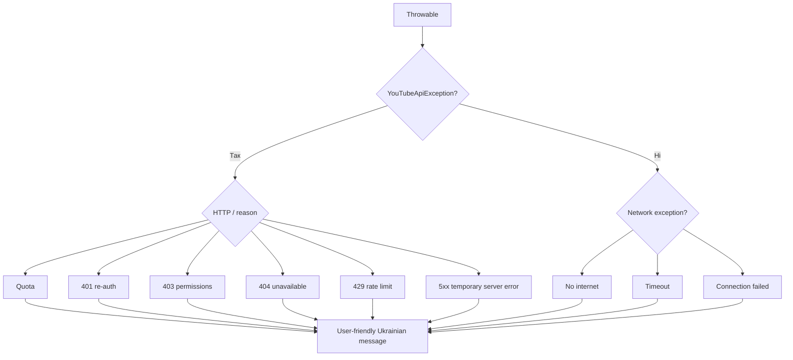

# v1.0.0-rc3 — Error handling

```mermaid
flowchart TD
    A[Throwable]
    --> B{YouTubeApiException?}

    B -- Так --> C{HTTP / reason}
    C --> D[Quota]
    C --> E[401 re-auth]
    C --> F[403 permissions]
    C --> G[404 unavailable]
    C --> H[429 rate limit]
    C --> I[5xx temporary server error]

    B -- Ні --> J{Network exception?}
    J --> K[No internet]
    J --> L[Timeout]
    J --> M[Connection failed]

    D --> N[User-friendly Ukrainian message]
    E --> N
    F --> N
    G --> N
    H --> N
    I --> N
    K --> N
    L --> N
    M --> N
```
