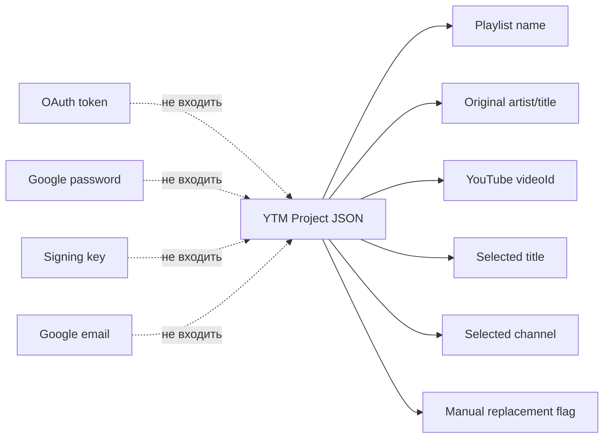

# v1.0.0-rc3 — Playlist Project data

```mermaid
flowchart LR
    P[YTM Project JSON]

    P --> N[Playlist name]
    P --> O[Original artist/title]
    P --> V[YouTube videoId]
    P --> T[Selected title]
    P --> C[Selected channel]
    P --> M[Manual replacement flag]

    X[OAuth token] -. не входить .-> P
    G[Google password] -. не входить .-> P
    K[Signing key] -. не входить .-> P
    E[Google email] -. не входить .-> P
```
