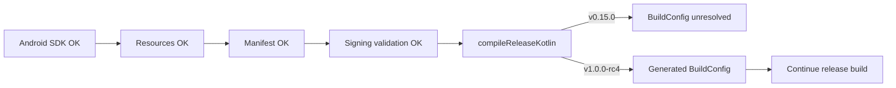

# v1.0.0-rc4 — Build hotfix flow

```mermaid
flowchart LR
    SDK[Android SDK OK]
    --> RES[Resources OK]
    --> MANIFEST[Manifest OK]
    --> SIGN[Signing validation OK]
    --> KOTLIN[compileReleaseKotlin]

    KOTLIN -->|v0.15.0| FAIL[BuildConfig unresolved]
    KOTLIN -->|v1.0.0-rc4| BC[Generated BuildConfig]
    BC --> NEXT[Continue release build]
```
