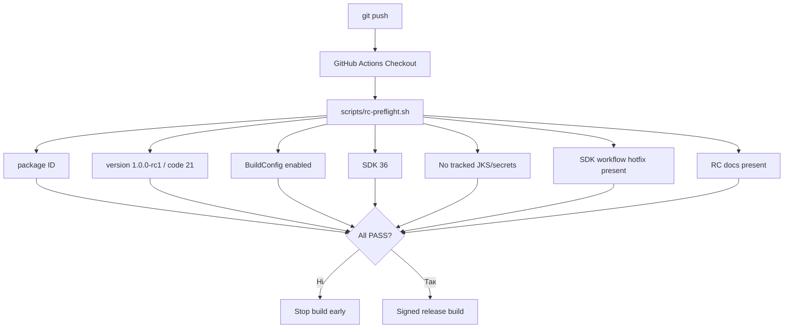

# v1.0.0-rc4 — RC preflight

```mermaid
flowchart TD
    A[git push]
    --> B[GitHub Actions Checkout]
    --> C[scripts/rc-preflight.sh]

    C --> D[package ID]
    C --> E[version 1.0.0-rc1 / code 21]
    C --> F[BuildConfig enabled]
    C --> G[SDK 36]
    C --> H[No tracked JKS/secrets]
    C --> I[SDK workflow hotfix present]
    C --> J[RC docs present]

    D --> K{All PASS?}
    E --> K
    F --> K
    G --> K
    H --> K
    I --> K
    J --> K

    K -- Ні --> L[Stop build early]
    K -- Так --> M[Signed release build]
```
