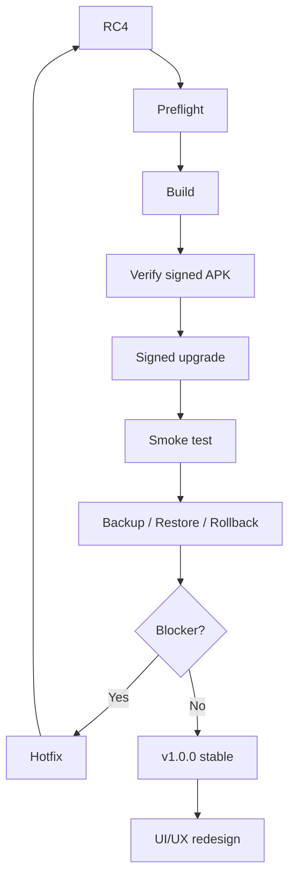

# RC4 — Stable release gate

```mermaid
flowchart TD
    A[RC4]
    --> B[Preflight]
    --> C[Build]
    --> D[Verify signed APK]
    --> E[Signed upgrade]
    --> F[Smoke test]
    --> G[Backup / Restore / Rollback]
    --> H{Blocker?}
    H -- Yes --> I[Hotfix]
    I --> A
    H -- No --> J[v1.0.0 stable]
    J --> K[UI/UX redesign]
```
