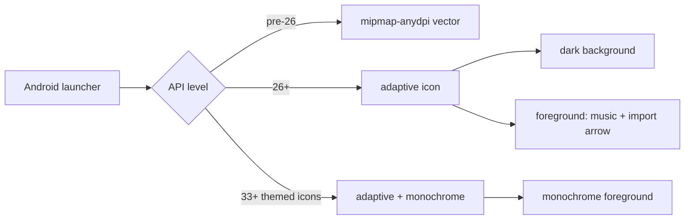

# v1.0.0 — App icon resources

```mermaid
flowchart LR
    A[Android launcher]
    --> B{API level}
    B -->|pre-26| C[mipmap-anydpi vector]
    B -->|26+| D[adaptive icon]
    B -->|33+ themed icons| E[adaptive + monochrome]

    D --> F[dark background]
    D --> G[foreground: music + import arrow]
    E --> H[monochrome foreground]
```
