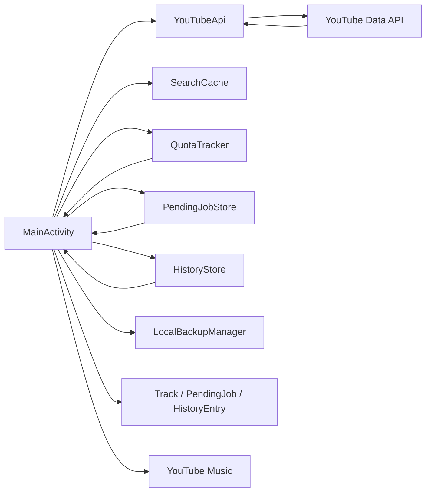

# YTM Importer v1.0.0 — Архітектура

## Нові файли

- `model/HistoryEntry.kt`
- `storage/HistoryStore.kt`

## Змінені моделі

- `Track` отримав `historyIndex`;
- `PendingTrack` зберігає `historyIndex`;
- `PendingJob` зберігає `sourceLabel`.

Новий модуль: `storage/LocalBackupManager.kt`.

## v1.0.0 additions

- `SearchCache.stats()` / `clearExpired()`;
- AndroidX `FileProvider`;
- internal `cache/shared_exports`;
- Diagnostics builder in `MainActivity`.
