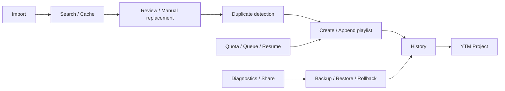

# v1.0.0 — Functional baseline

```mermaid
flowchart LR
    I[Import]
    --> S[Search / Cache]
    --> R[Review / Manual replacement]
    --> D[Duplicate detection]
    --> P[Create / Append playlist]
    --> H[History]
    --> Y[YTM Project]

    Q[Quota / Queue / Resume] --> P
    B[Backup / Restore / Rollback] --> H
    X[Diagnostics / Share] --> B
```
