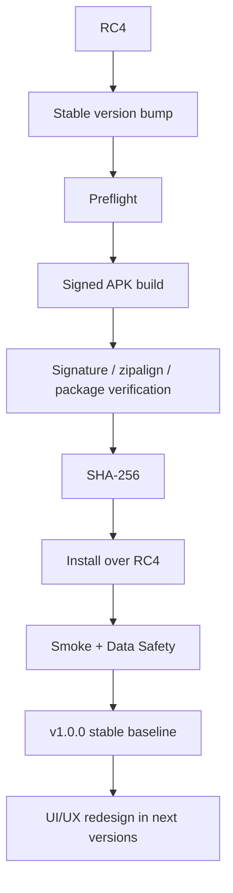

# v1.0.0 — Stable release flow

```mermaid
flowchart TD
    A[RC4]
    --> B[Stable version bump]
    --> C[Preflight]
    --> D[Signed APK build]
    --> E[Signature / zipalign / package verification]
    --> F[SHA-256]
    --> G[Install over RC4]
    --> H[Smoke + Data Safety]
    --> I[v1.0.0 stable baseline]
    --> J[UI/UX redesign in next versions]
```
