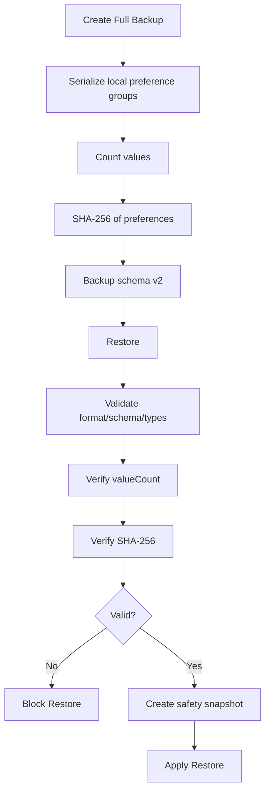

# v1.2.0 — Backup integrity

```mermaid
flowchart TD
    A[Create Full Backup]
    --> B[Serialize local preference groups]
    --> C[Count values]
    --> D[SHA-256 of preferences]
    --> E[Backup schema v2]

    E --> F[Restore]
    F --> G[Validate format/schema/types]
    G --> H[Verify valueCount]
    H --> I[Verify SHA-256]
    I --> J{Valid?}
    J -- No --> K[Block Restore]
    J -- Yes --> L[Create safety snapshot]
    L --> M[Apply Restore]
```
